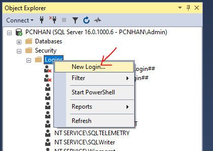
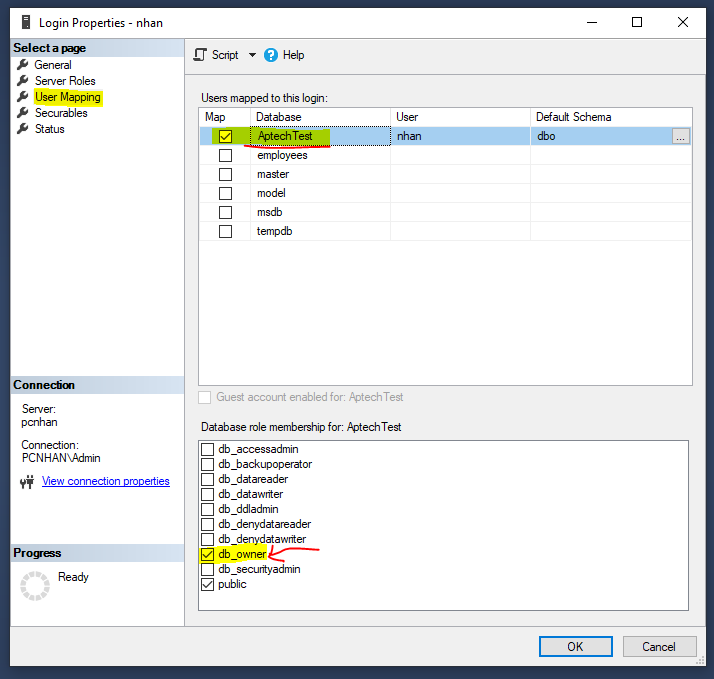
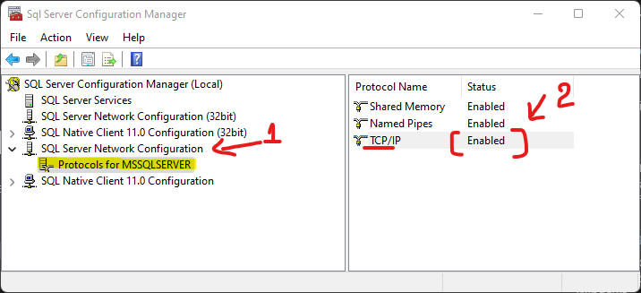
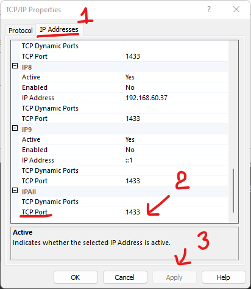

# Nodejs width SQL server

## Cài đặt SQL server

- Cách cài đặt phần mềm

    - SQL SERVER 2019 EXPRESS EDITION: https://www.microsoft.com/en-us/sql-server/sql-server-downloads --> Tải bản Express
    - SQL SERVER MANAGEMENT STUDIO (SSMS): https://learn.microsoft.com/en-us/sql/ssms/download-sql-server-management-studio-ssms?view=sql-server-ver16

- Hướng dẫn cài đặt: 

 - CHo win: https://youtu.be/JIvu6wx8BSY
 - CHo Mac: https://www.youtube.com/watch?v=VgXci_5hzxY


## Cấu hình SQL server

### Bước 1 - Chuyển chế độ đăng nhập

- Đăng nhập với chế độ Windown Authentication
- Sau đó kích phải lên tên Instance kết nối, chọn Properties


- Sau đó chọn Menu Security, rồi thực hiện chọn như hình dưới


### Bước 2 - Tạo Database

- Đăng nhập với chế độ Windown Authentication
- Click phải lên Databases --> chọn New Database
- Đặt tên sau đó nhấn OK

###  Bước 3 - Tạo tài khoản SQL Server - Authentication

- Đăng nhập với chế độ Windown Authentication
- Sau đó xổ Mục Security ra --> Click phải lên mục Login --> chọn New Login



- Tại tab General điền tên user vào ô Login name, điền password, confirm passowrd vào, rồi tick bỏ chọn Enfoce password policy

- Làm như hình dưới


- Tab User Mapping, chọn tên Database bạn muốn add user này vào quản trị
- Sau đó bên dưới bạn chọn db_owner
- Cuối cùng click OK 



###  Bước 4 - Bật  TCP/IP

- Vào Sql Server Configruration Manager



- Tại mục SQL Server Network Configruration --> chọn Protocals for MSSQLSERVER
- Tại cửa sổ bên phải: Click phải lên TCP/IP --> Enable

- Sau đó click phải lên TCP/IP --> Properties


Chọn qua tab IP Address --> Tìm đến dòng cuối cùng mục IPAll --> Sửa TCPT Port thành 1433

>- database: BikeStore
>- login: AdminBikeStore - admin@2024

## kết nối SQL server

- B1: copy folder dự án đã làm hôm trước day 7. `day3_restful_api_express`( trừ folder node_modules ra )
- B2: chạy lệnh `yarn` để kéo các package về 
- B3: Cài TypeORM, mssql, reflect-metadata vào ứng dụng
```bash
yarn add typeorm mssql reflect-metadata
```
- B4: Cấu hình kết nối với sql server

trong folder src/databases tạo file `data-soucre.ts ` cấu hình theo mẫu sau
Tài liệu (https://typeorm.io/data-source) & (https://typeorm.io/migrations)
```ts
import "reflect-metadata";
import { DataSource } from 'typeorm';

export const myDataSource = new DataSource({
  type: 'mssql', // loại database 
  host: 'Linh', //Computer Name
  port: 1433, // cổng mặc định của sql server
  username: 'AdminBikeStore',
  password: 'admin@2024',
  database: 'BikeStore', //Tên Database
  entities: ['src/databases/entities/*.entity{.ts,.js}'], //Chỉ rõ thư mục chứa các file entity
  synchronize: true, //Đồng bộ với Database
  logging: false, //ghi log
  options: {
    encrypt: false, //True khi chạy trên production
  },
});

```

- B5: Tạo các model - entities
trong folder src/databases/entities tạo file `category.entity.ts`

```ts
import { Entity, PrimaryGeneratedColumn, Column } from "typeorm";
@Entity({name: 'categories'}) // nếu muốn thay đổi tên table trên database mặc định lấy theo `Category` thành `categories` thì ta thêm {name: 'categories'}. còn không thì sẽ lấy theo mặc định `Category`
export class Category {
    @PrimaryGeneratedColumn()
    category_id: number

    @Column()
    category_name: string

    @Column()
    description: string

    @Column()
    slug: string

    @Column()
    order: number
}
```
Lúc này sẽ bị báo lỗi do chưa setting config entities

ta setting thêm  cho file `tsconfig.json` để nó hiểu entities

tài liệu (https://typeorm.io/#create-an-entity)

```json
{
  "compilerOptions": {
    "target": "es2016",
    "module": "commonjs",
    "outDir": "dist/",
    "strict": true,
    "sourceMap": true,
    "esModuleInterop": true,
    "skipLibCheck": true,
    "forceConsistentCasingInFileNames": true,
    "experimentalDecorators": true,
    "emitDecoratorMetadata": true,
    "strictPropertyInitialization": false
  },
}
```
- B6: trong folder src/services/ tạo file `categories.service.ts` , liên kết myDataSource với entities

```ts

import { Category } from '../databases/entities/category.entity';
import { myDataSource } from '../databases/data-soucre';

const categoryRepository = myDataSource.getRepository(Category)
// Lấy tất cả record
const findAll = async ()=>{
    const categories = await categoryRepository.find()
  return categories
}

export default {
    findAll
}
```
- B7: Kết nối myDataSource vào server Express

tại file `server.ts ` chỉnh sửa phần kết nối 
```ts
import app from './src/app'
import {globalConfig} from './src/constants/configs'
import { myDataSource } from './src/databases/data-soucre'

const PORT = globalConfig.POST

// Kết nối với SQL server 

myDataSource
    .initialize()
    .then(() => {
        console.log("Kết nối với SQL Server thành công !")
    })
    .catch((err) => {
        console.error("Error during Data Source initialization:", err)
    })


app.listen(PORT, () => {
  console.log(`Example app listening on port http://localhost:${PORT}`)
})
```
Chạy lệnh `yarn dev` để xem kết quả

## Hoàn thiện tạo các entities mssql

- tạo entities <https://typeorm.io/entities>


